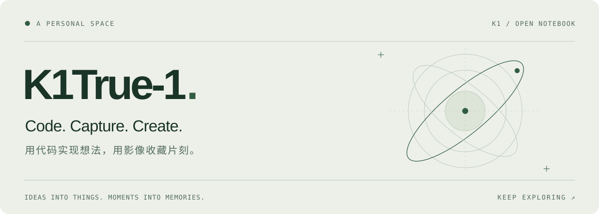
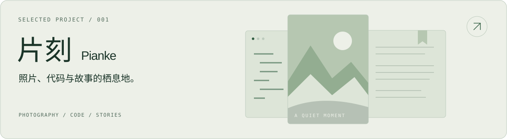

<picture>
  <source media="(prefers-color-scheme: dark)" srcset="./assets/header-dark.svg">
  <source media="(prefers-color-scheme: light)" srcset="./assets/header-light.svg">
  
</picture>

  <a href="https://pk.k1true.chatgpt.site"><b>片刻 · 个人空间 ↗</b></a>
  &nbsp;&nbsp; / &nbsp;&nbsp;
  <a href="https://github.com/K1True-1/pianke-personal-space">探索项目</a>
  &nbsp;&nbsp; / &nbsp;&nbsp;
  <a href="https://github.com/K1True-1?tab=repositories">全部仓库</a>

 

### 把想法写成代码，把片刻留成作品。

你好，我是 **K1True-1**。这里记录我的项目与探索，也给照片和故事留一个位置。

 

<table>
  <tr>
    <td width="33%" valign="top">
      01 / CODE
      <h3>构建</h3>
      
从一个小想法开始， 慢慢做成可以使用的东西。

    </td>
    <td width="33%" valign="top">
      02 / CAPTURE
      <h3>记录</h3>
      
为镜头里的风景， 也为日常中值得留下的片刻。

    </td>
    <td width="33%" valign="top">
      03 / CREATE
      <h3>创作</h3>
      
在代码之外， 给文字和故事一点空间。

    </td>
  </tr>
</table>

 

## 正在打磨

<a href="https://github.com/K1True-1/pianke-personal-space">
  <picture>
    <source media="(prefers-color-scheme: dark)" srcset="./assets/pianke-dark.svg">
    <source media="(prefers-color-scheme: light)" srcset="./assets/pianke-light.svg">
    
  </picture>
</a>

**[片刻 · Pianke](https://pk.k1true.chatgpt.site)** 是我的个人空间：把相机里的风景、写过的小程序和正在创作的故事，放在同一个地方。

- **照片相册** — 保存原图，随时回看值得留下的画面。
- **代码收藏** — 归档源文件与小项目，让想法有迹可循。
- **小说书架** — 收好文字，继续还没写完的故事。

项目使用：TypeScript · React · Cloudflare Workers · D1 · R2

 

[打开个人空间 ↗](https://pk.k1true.chatgpt.site) &nbsp; · &nbsp; [查看源码 ↗](https://github.com/K1True-1/pianke-personal-space)

 

---

  保持好奇，慢慢构建。 Always curious. Still creating.

