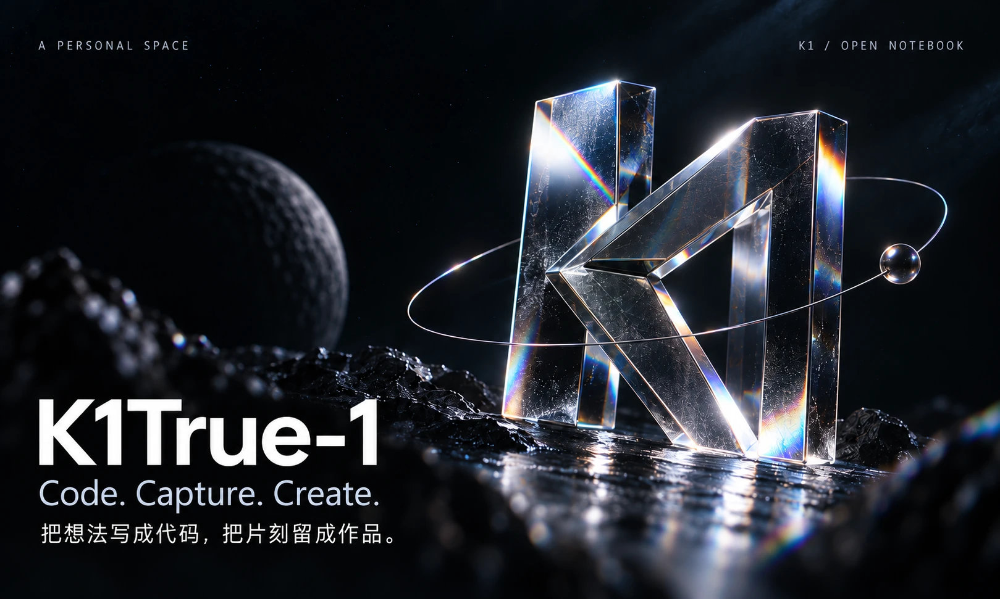
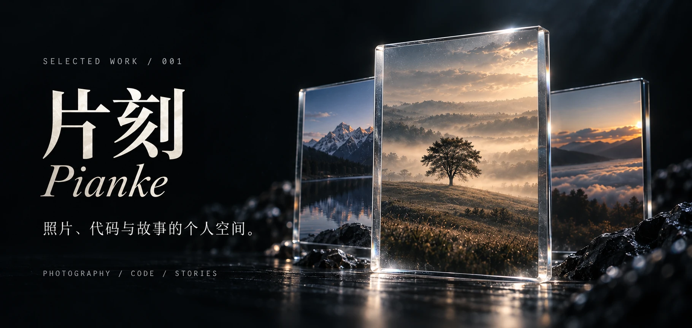

  

<h2>你好，我是 K1True-1。</h2>

这里记录我的项目与探索，也给照片和故事留一个位置。

CODE &nbsp; / &nbsp; PHOTOGRAPHY &nbsp; / &nbsp; STORIES

  

相机里的风景、写过的小程序、正在创作的故事。 在<strong>片刻</strong>，把值得留下的东西，慢慢收好。

项目使用：TypeScript · React · Cloudflare Workers · D1 · R2

  <a href="https://pk.k1true.chatgpt.site"><b>打开个人空间 ↗</b></a>
  &nbsp;&nbsp; · &nbsp;&nbsp;
  <a href="https://github.com/K1True-1/pianke-personal-space"><b>查看源码 ↗</b></a>
  &nbsp;&nbsp; · &nbsp;&nbsp;
  <a href="https://github.com/K1True-1?tab=repositories">全部仓库</a>

  保持好奇，慢慢构建。 Always curious. Still creating.

